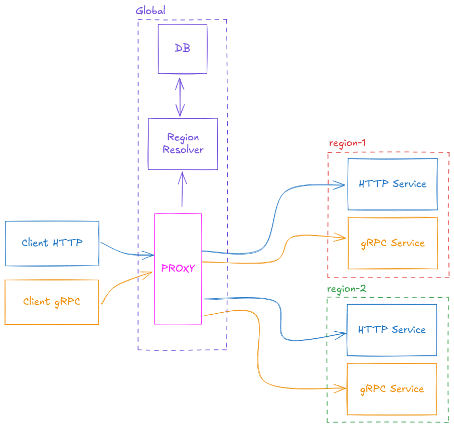

# Poly-Route
A pluggable multi-protocol<sup>*</sup> transparent reverse proxy with multi-region support



Poly-Route provides a single global entrypoint for regional APIs. The region is resolved automatically using data from another service instead of being chosen by the caller.

*Work in progress. Currently, supports gRPC and HTTP.*

## Table of Contents
- [What's in the box](#whats-in-the-box)
- [Run the demo](#run-the-demo)
    - [In Docker](#in-docker)
    - [From CLI locally](#from-cli-locally)
        - [Start the test servers](#start-the-test-servers)
        - [Start the proxy with the test config](#start-the-proxy-with-the-test-config)
        - [Start the test client](#start-the-test-client)
- [Next steps](#next-steps)
    - [More testing](#more-testing)
    - [Setup](#setup)
- [Roadmap](#roadmap)
- [Configuration Guide](#configuration-guide)
    - [HTTP](#http)
    - [gRPC](#grpc)
    - [Region Retriever](#region-retriever)
    - [Flow](#flow)

## What's in the box
The proxy itself, fully configurable and pluggable (the bright pink box in the above image).

You must provide your own region resolver and your own client and backend services

**Notes**
* A database IS NOT required for the region resolver if you can resolve without it
* You DO NOT need to define a client per protocol
* Services MUST be reachable from the proxy
* The region resolver MUST BE reachable from the proxy

## Run the demo

### In Docker
Using the utility makefile:
```
make test
```

or manually, by starting the example environment with docker compose

```shell
docker compose up
```

This starts three services:
- `poly-route`: the proxy server
- `test-servers`: mocked backends
    - two HTTP servers (EU and US)
    - two gRPC servers (EU and US)
    - one HTTP server that returns region values
- `test-client`: a client that will call all the backends through the proxy

### From CLI locally

#### Start the test servers
In a terminal run:

```shell
go run ./example/server
# mock http backend eu listening on :8085
# mock http backend us listening on :8081
# mock gRPC server listening on :9095
# mock gRPC server listening on :9091
# mock graphql backend eu listening on :7070
# mock graphql backend us listening on :7071
```

The following ports must be available:
- `1234`
- `8085`
- `8081`
- `7070`
- `7071`
- `9095`
- `9091`

#### Start the proxy with the test config
```shell
CONFIG_FILE_PATH=./example/config.yaml go run .
# http proxy listening on :8888
# graphql proxy listening on :7777
# gRPC proxy listening on [::]:9999
```

Ports `9999`, `8888` and `7777` must be available

#### Start the test client
```shell
HTTP_HOST=http://localhost:8888 GRPC_HOST=localhost:9999 GRAPHQL_HOST=http://localhost:7777 go run ./example/client
```

Example output:
```shell
Testing GRPC...
 Received BiDirectionalStream: Stream response for res-123
 Received BiDirectionalStream: Stream response for res-456
 Received BiDirectionalStream: Stream response for res-789
 Received ClientStream: res-123;res-456;res-789;
 Received ServerStream: res-123 response #0
 Received ServerStream: res-123 response #1
 Received ServerStream: res-123 response #2
 Received ServerStream: res-123 response #3
 Received ServerStream: res-123 response #4
 Received BiDirectionalStream: Stream response for res-123
 Received BiDirectionalStream: Stream response for res-456
 Received BiDirectionalStream: Stream response for res-789
 Received ClientStream: res-123;res-456;res-789;
 Received ServerStream: res-123 response #0
 Received ServerStream: res-123 response #1
 Received ServerStream: res-123 response #2
 Received ServerStream: res-123 response #3
 Received ServerStream: res-123 response #4
 data:"Response for res-123"
 data:"Response for res-123"

Testing HTTP...
 {"backend": eu, "addr": :8085, "path": GET/}
 {"backend": eu, "addr": :8085, "path": POST/}
 {"backend": us, "addr": :8081, "path": GET/}
 {"backend": us, "addr": :8081, "path": POST/}

Testing GraphQL...
 {"data":{"hello":"{\"backend\": eu, \"addr\": :7070, \"path\": \"graphql/hello\"}"}}
 {"data":{"hello":"{\"backend\": us, \"addr\": :7071, \"path\": \"graphql/hello\"}"}}
```

## Next steps

### More testing
Experiment with [config.yaml](example/config.yaml) or [docker-config.yaml](example/docker-config.yaml). Update [test client](example/client/main.go) and [test servers](example/server/main.go) if needed

You can also bypass the client and call the proxy directly
- use [curl](https://curl.se/) for HTTP on `http://localhost:8888`
- use [grpcurl](https://github.com/fullstorydev/grpcurl) for gRPC on `localhost:9999`

Protobuf definitions are in [example/mock/proto](example/mock/proto). The HTTP server accepts any method on `/`

**Important**
Set the correct region value in each request
- for gRPC set metadata key `poly-route-region`
- for HTTP set header `X-Poly-Route-Region`

Supported values are listed under `region_resolver.mapping` in [config.yaml](example/config.yaml)
```
europe-west1
eu-west1
us-east1
```

### Setup
Poly-Route is plug and play
- create a region retrieval endpoint if you need one
- define config.yaml
- run the provided docker image in your stack


## Roadmap
- support nested keys in region resolver responses
- logger configuration
- improve logs
- improve error messages
- support more protocols
- TLS support
- support POST for region resolver
- support for direct-DB-access region resolver

## Configuration Guide

### HTTP

```yaml
http:
  listen: "8888"
  destinations:
    /:
      euw1: "http://localhost:8085"
      use1: "http://localhost:8081"
```

Proxy listens on port 8888. All HTTP requests to `/` are routed by region:
- `euw1` -> `http://localhost:8085`
- `use1` -> `http://localhost:8081`

### GraphQL
Although GraphQL runs over HTTP and could be configured using the [HTTP Configuration](#http) poly-route provides a dedicated `graphql` option as a convenient shorthand

```yaml
graphql:
  listen: "7777"
  destinations:
    /graph:
      euw1: "http://localhost:7070/graphql"
      use1: "http://localhost:7071/graphql"
```

Proxy listens on port 7777. All GraphQL (over HTTP) requests to `/graph` are routed by region:
- `euw1` -> `http://localhost:7070/graphql`
- `use1` -> `http://localhost:7071/graphql`

### gRPC

```yaml
grpc:
  listen: "9999"
  destinations:
    "/mockserver.v1.MockService/Invoke":
      euw1: "localhost:9095"
      use1: "localhost:9091"
```

Proxy listens on port 9999. Each RPC method is routed to the correct backend by region.

### Wildcards
To simplify HTTP and gRPC method routing, poly-route supports wildcards (`*`).  
This allows specifying broad patterns instead of enumerating each endpoint individually.

#### HTTP Wildcards
The router always prefers an exact match over a wildcard match.
> Example: If the entrypoint is `/test/v1/config` and the configuration specifies both `/test/v1/*` and `/test/v1/config` destinations, `/test/v1/config` will be chosen.

- Only suffix wildcards (`.../*`) are supported for HTTP routes.
- The longest matching prefix wins.
- The part of the entrypoint that matches the wildcard is appended to the destination.

> Example:  
> Entrypoint: `/test/v1/config`  
> Route: `/test/*` -> `http://localhost`  
> Resulting request: `http://localhost/v1/config`

> Exact match example:  
> Route: `/test/v1/config` -> `http://localhost`  
> Resulting request: `http://localhost`

A single asterisk (`"*"`) matches all entrypoints.  
It is used as a fallback if no more specific route is found.

#### GRPC Wildcards
Similarly to [HTTP wildcards](#http-wildcards) exact matches are preferred over wildcards,
in case no exact match is found, the best one is returned.
If no best match is found and a match-all wildcard (`"*"`) is present, then that route is chosen.

#### Sample Configuration
~~~yaml
grpc:
  listen: "9999"
  destinations:
    "*":
      euw1: "localhost"
      use1: "localhost"
    "/mockserver.v1.MockService/*":
      euw1: "localhost:9095"
      use1: "localhost:9091"

http:
  listen: "8888"
  destinations:
    "/test/v1/*":
      euw1: "http://localhost:8085"
      use1: "http://localhost:8081"
    "/test/*":
      euw1: "http://localhost:8085"
      use1: "http://localhost:8081"
    "*":
      euw1: "http://localhost:8085"
      use1: "http://localhost:8081"
~~~

### Region Retriever

```yaml
region_retriever:
  type: "http"
  url: "http://localhost:1234/userinfo"
  method: "GET"
  query_param: "user_id"
  region_resolver:
    type: "map"
    field: "country"
    mapping:
      europe-west1: "euw1"
      eu-west1: "euw1"
      us-east1: "use1"
```

Proxy queries `http://localhost:1234/userinfo?user_id=...`.  
The `country` field in the response is mapped to an internal region key.
- `europe-west1` or `eu-west1` -> `euw1`
- `us-east1` -> `use1`

Optionally, the `region_retriever` type could be set to `"static"`.
In this case, the `region_retriever` field `static` should also be present

```yaml
region_retriever:
  type: "static"
  static: "eu-west"
```

Static mode is useful when testing the proxy integration.
It removes the extra noise caused by the region resolver.

### Flow

1. Client sends HTTP or gRPC request to proxy
2. Proxy calls region retriever to resolve region
3. Resolver maps `country` to `euw1` or `use1`
4. Proxy forwards request to backend defined under that region

