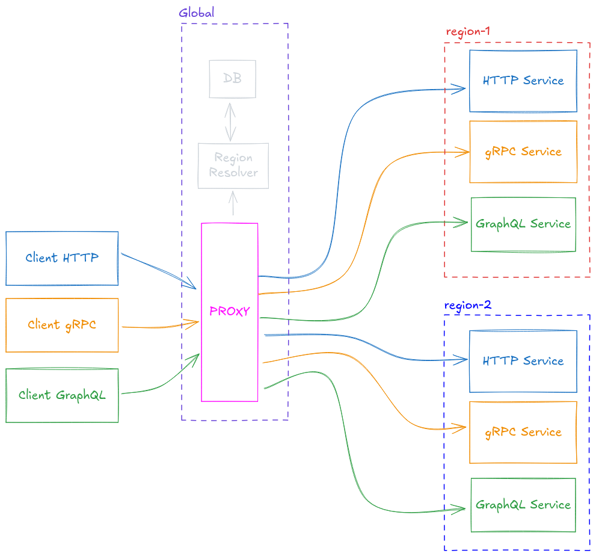

# poly-route
A pluggable protocol-agnostic transparent reverse proxy.


This project stems from the need of having a single, global, entrypoint for regional APIs.
Our constraint was that the region must be inferred by a value provided by another service and must not be picked by the caller.

## Run the demo

### Start the test servers
```shell
go run ./example/server
```

Make sure the following ports are available:
- `1234`
- `8085`
- `8081`
- `9095`
- `9091`

### Start the proxy with the test config
```shell
CONFIG_FILE_PATH=./example/config.yaml go run .
```

Make sure port `9999` is available.

### Start the test client
```shell
go run ./example/client
```

The output should look something like:
```shell
Received BiDirectionalStream: Stream response for res-123
Received BiDirectionalStream: Stream response for res-456
Received BiDirectionalStream: Stream response for res-789
Received ClientStream: res-123;res-456;res-789;
Received ServerStream: res-123 response #0
Received ServerStream: res-123 response #1
Received ServerStream: res-123 response #2
Received ServerStream: res-123 response #3
Received ServerStream: res-123 response #4
Received BiDirectionalStream: Stream response for res-123
Received BiDirectionalStream: Stream response for res-456
Received BiDirectionalStream: Stream response for res-789
Received ClientStream: res-123;res-456;res-789;
Received ServerStream: res-123 response #0
Received ServerStream: res-123 response #1
Received ServerStream: res-123 response #2
Received ServerStream: res-123 response #3
Received ServerStream: res-123 response #4
data:"Response for res-123"
data:"Response for res-123"
{"backend": eu, "addr": localhost:8085, "path": GET/}
{"backend": eu, "addr": localhost:8085, "path": GET/}
{"backend": us, "addr": localhost:8081, "path": GET/}
{"backend": us, "addr": localhost:8081, "path": GET/}
```

### Next steps
Feel free to play around with the test [config.yaml](example/config.yaml), just remember to update the [test client](example/client/main.go) and the [test servers](example/server/main.go)
